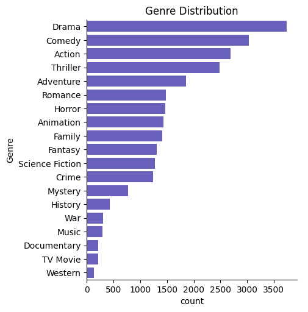
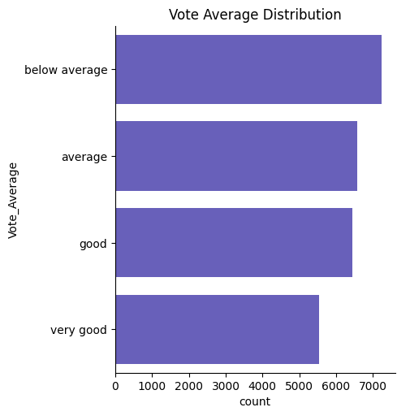
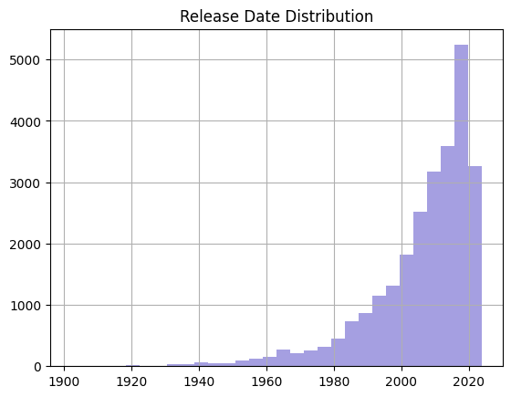

<div align="center">


<br/>


</div>

<br/>

## 📋 Table of Contents
- [Overview](#-overview)
- [Dataset](#-dataset)
- [Tech Stack](#-tech-stack)
- [Data Cleaning & Preprocessing](#-data-cleaning--preprocessing)
- [Key Insights](#-key-insights)
- [Visualizations](#-visualizations)
- [Project Structure](#-project-structure)
- [Getting Started](#-getting-started)
- [License](#-license)
- [Connect](#-connect)

---

## 🎬 Overview

An end-to-end **exploratory data analysis (EDA)** on a dataset of ~9,800 movie titles. The notebook walks through cleaning a messy real-world CSV, engineering a few analytical features, and visualizing what shows up in the data around a title's popularity, audience rating, genre mix, and release era.

Everything runs inside a single, self-contained Jupyter Notebook — `netflix_data_analysis.ipynb`.

## 📊 Dataset

The raw data lives in `mymoviedb.csv` — a TMDB-style movie metadata export.

| | Raw | After Cleaning |
|---|---|---|
| **Rows** | 9,837 | 25,792 *(one row per genre, after exploding multi-genre titles)* |
| **Columns** | 9 | 7 |

**Original columns:** `Release_Date`, `Title`, `Overview`, `Popularity`, `Vote_Count`, `Vote_Average`, `Original_Language`, `Genre`, `Poster_Url`

> 💡 The CSV itself isn't tracked in this repo (standard practice for raw data). Drop your own copy of `mymoviedb.csv` in the project root before running the notebook.

## 🧰 Tech Stack

| Purpose | Tools |
|---|---|
| Data wrangling | `pandas`, `numpy` |
| Visualization | `matplotlib`, `seaborn` |
| Environment | Jupyter Notebook |

## 🧹 Data Cleaning & Preprocessing

The notebook takes the raw CSV through seven steps before any analysis happens:

1. **Type correction** — `Vote_Average` and `Vote_Count` coerced from `object` to numeric
2. **Date parsing** — `Release_Date` parsed to `datetime`, then reduced to release **year**
3. **Column pruning** — dropped `Overview`, `Original_Language`, `Poster_Url` (not needed for this analysis)
4. **Genre explosion** — multi-genre strings like `"Action, Adventure"` are split and exploded into one row per genre
5. **Missing values** — remaining nulls dropped
6. **Rating binning** — `Vote_Average` bucketed into four quantile-based labels:

   ```python
   df['Vote_Average_Labels'] = pd.qcut(df['Vote_Average'], q=4, labels=False, duplicates='drop')
   # 0: below average · 1: average · 2: good · 3: very good
   ```

7. **Deduplication** — exact duplicate rows removed

**Result:** a tidy 25,792 × 7 frame, one genre per row, ready to plot.

## 🔍 Key Insights

| | Title | Popularity | Rating |
|---|---|---|---|
| 🔥 **Most popular** | Spider-Man: No Way Home (2021) | 5,083.95 | Very good |
| 🧊 **Least popular** *(tied)* | The United States vs. Billie Holiday (2021) · Threads (1984) | 13.35 | Good · Very good |

- **Genre mix** skews heavily toward **Drama, Comedy, and Action** — the three most-tagged genres by a clear margin — while Western and TV Movie are the rarest.
- **Ratings** are fairly evenly spread across the four quantile bands, with a slight lean toward the *below average* bucket.
- **Release years** are heavily right-skewed — the vast majority of titles are from the last two decades, with a sharp spike around 2020–2021, and only a thin tail of titles going back to the early 1900s.

## 📈 Visualizations

<div align="center">

**Genre Distribution**



**Vote Average Distribution**



**Release Year Distribution**



</div>

## 📁 Project Structure

```
netflix-data-analysis/
├── netflix_data_analysis.ipynb     # Main analysis notebook
├── mymoviedb.csv                   # Raw dataset (add your own copy)
├── assets/                         # Exported plots used in this README
│   ├── genre_distribution.png
│   ├── vote_average_distribution.png
│   └── release_year_distribution.png
├── requirements.txt
└── README.md
```

## 🚀 Getting Started

```bash
# Clone the repo
git clone https://github.com/Suman18-bit/netflix-data-analysis.git
cd netflix-data-analysis

# Install dependencies
pip install -r requirements.txt

# Launch the notebook
jupyter notebook netflix_data_analysis.ipynb
```

**`requirements.txt`**
```
pandas
numpy
matplotlib
seaborn
jupyter
```

## 📝 License

Released under the MIT License — feel free to use, modify, and build on this.

## 🤝 Connect

<div align="center">

<a href="https://github.com/Suman18-bit"></a>
<a href="https://linkedin.com/in/suman-seth-b05417324"></a>


</div>
